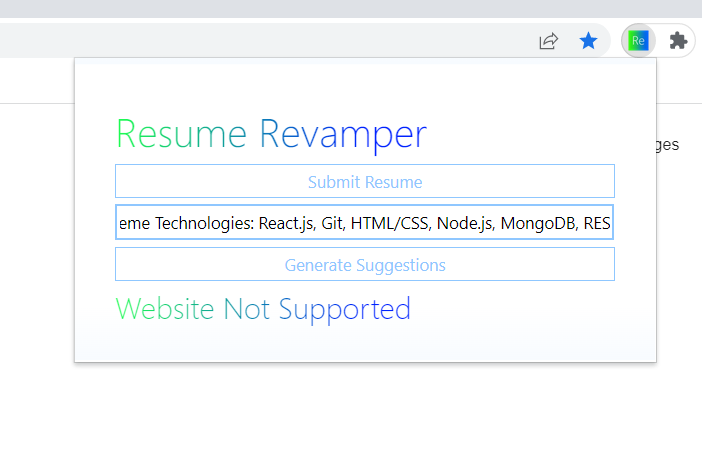
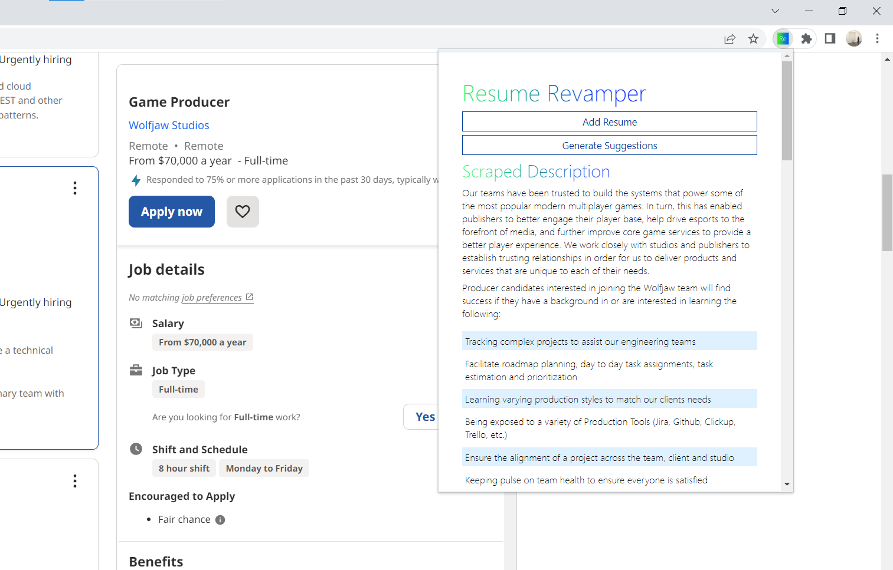
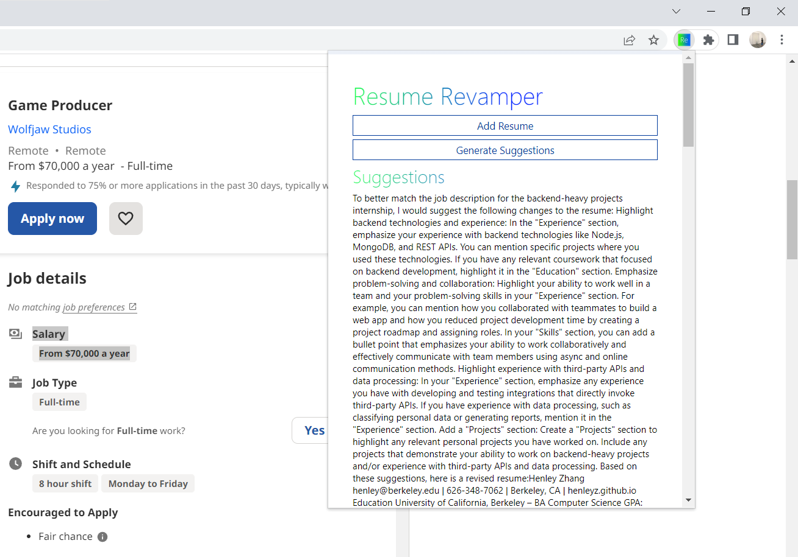

# ResumeRevamper

Tailor your resume to job descriptions through the power of AI!
#Instructions
1. Download or clone this code
2. Get an api key from OpenAI at https://openai.com/blog/openai-api
3. Paste the api key in popups.js:2 at const API_KEY = "<paste here>" 
4. Install the extension by loading in developer mode
#How to use
1. Click "Add Resume", and paste it in the text box and click submit resume.

2. Navigate to a job posting in indeed.com, glassdoor.com, or linkedin.com and click on the extension. The job description should appear.

3. Click "Generate Suggestions." The AI will give suggestions to improve your resume and a possibly a revised version of your resume!

4. Profit?

#Prompt
Congratulation on moving on to the next round of interviews!

Welcome to the take-home assignment.

In this assignment, you will be building a chrome extension that takes your resume and whenever the user is on a job application page, it understands the requirements for the job and gives suggestions on the resume using OpenAI. This assignment aims to give you hands-on experience in building a chrome extension that leverages the power of OpenAI to provide personalized recommendations.

Overview
Your task is to build a chrome extension that takes the user's resume as input and provides personalized suggestions for improving the resume based on the job requirements. The extension should work in the following way:

Whenever the user is on a job application page, the extension should be able to extract the job requirements from the page. You can use any method you deem fit, including scraping the page or using an API.

Once the job requirements are extracted, the extension should be able to compare them with the user's resume and identify areas where the user's skills and experience match or don't match the job requirements.

Based on the comparison, the extension should provide personalized suggestions for improving the user's resume. You should use OpenAI's API for this, and you can choose the specific model and endpoint based on your research and experimentation.

The suggestions the extension provides should be displayed in real-time as the user edits their resume. This means that the extension should be able to detect when the user is editing their resume and update the suggestions accordingly.

Requirements
The extension should be built using HTML, CSS, and JavaScript. You can use any front-end frameworks or libraries you like, but the final product should be a Chrome extension.

The extension should use OpenAI's API to generate personalized suggestions for the user's resume.

The extension should be able to extract job requirements from job application pages. You can use any method you like for this, including scraping or using an API.

The extension should be able to compare the job requirements with the user's resume and provide personalized suggestions in real time.

The extension should be well-documented, with clear instructions on how to install and use it.

Bonus Points
Implement a feature that allows the user to save their resume and track their progress over time.

Implement a feature that allows the user to customize the suggestions the extension provides.

Implement a feature allowing users to import their resume from popular job sites like LinkedIn or Indeed.

Submission Guidelines
Your solution should be submitted as a ZIP file containing the source code, documentation, and any necessary instructions for installing and using the extension.

You should also include a README file that explains how to use the extension and any additional features you have implemented.

Your code should be well-organized, well-documented, and easy to understand.

Evaluation Criteria
Functionality: Does the extension meet the requirements outlined above? Does it work as expected?

Code quality: Is the code well-organized, well-documented, and easy to understand?

User experience: Is the extension easy to use and understand? Does it provide clear and useful feedback to the user?

Creativity: Have you implemented any additional features or functionality that adds value to the extension?

Conclusion
We hope that you enjoy working on this assignment and look forward to seeing your solution. If you have any questions or run into any issues, please don't hesitate to reach out to us for help. Good luck!
Bhavye Khetan
about 2 hours ago
